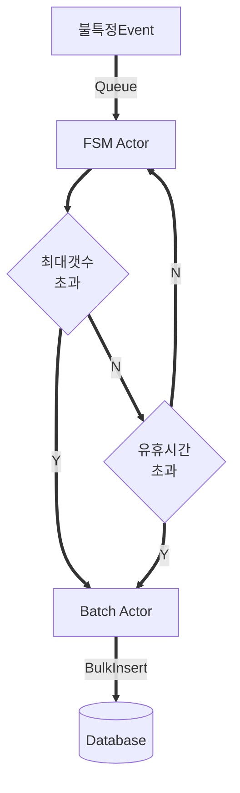

* 
{:toc}

## [EventListenerAPI](https://github.com/psmon/EventListenerAPI)
---
* 이벤트마다 커넥션을 사용하는 것 보다  ***커넥션 `1` : 이벤트 `1`*** 
  이벤트를 모아서 한번에 처리하는 것이 효율적이다.  ***커넥션 `1` : 이벤트 `N`***
* 대표적인 케이스로는 로그 데이터를 적재하는 경우

<!-- 
// TODO: mermaid.js 렌더링 추가 필요

-->

graph TD 
event[불특정Event]; FSM[FSM Actor]; Batch[Batch Actor]; isIdeal{유휴시간\n초과}; isMax{최대갯수\n초과}; DB[(Database)]; event == Queue ==> FSM; FSM ==> isMax; isMax == N ==> isIdeal; isMax == Y ==> Batch; isIdeal == N ==> FSM; isIdeal == Y ==> Batch; Batch == BulkInsert ==> DB; 

<!-- 
graph TD; event[불특정Event]; FSM[FSM Actor]; Batch[Batch Actor]; isIdeal{유휴시간\n초과}; isMax{최대갯수\n초과}; DB[(Database)]; event == Queue ==> FSM; FSM ==> isMax; isMax == N ==> isIdeal; isMax == Y ==> Batch; isIdeal == N ==> FSM; isIdeal == Y ==> Batch; Batch == BulkInsert ==> DB; 
-->